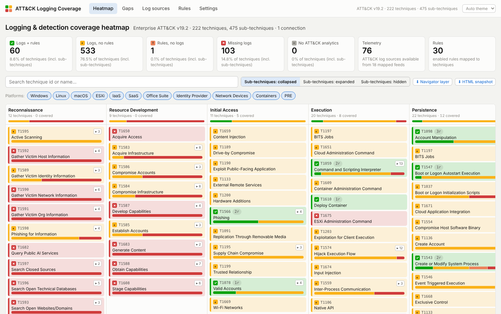
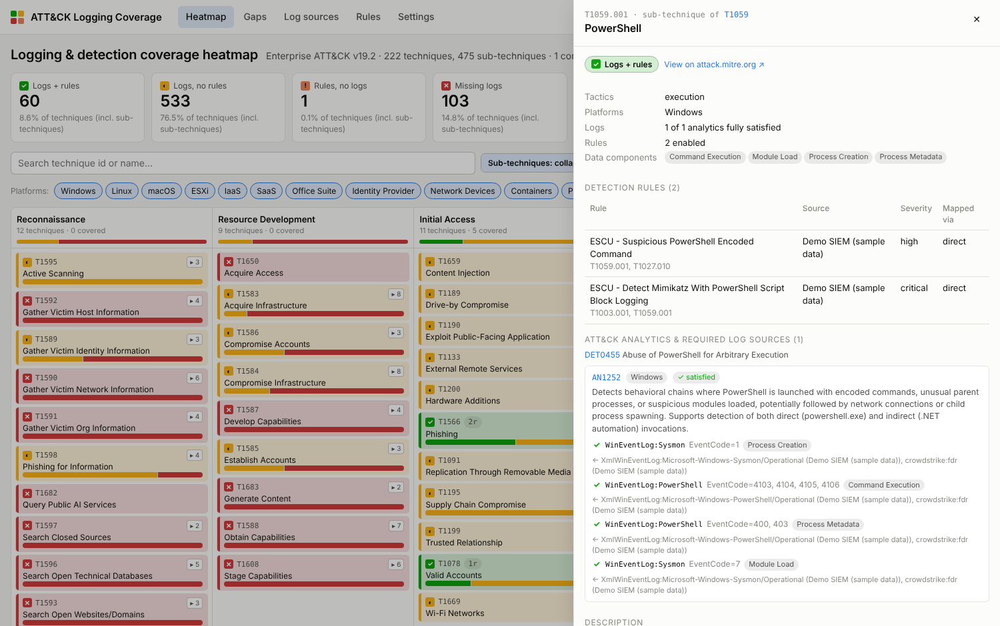

# ATT&CK Logging Coverage Heatmap

An interactive MITRE ATT&CK® heatmap that shows, for every tactic and technique, whether your SIEM
actually has **the logs** ATT&CK says you need and **a detection rule** that uses them.

It connects to your SIEM / telemetry pipeline (Splunk, CrowdStrike Falcon Next-Gen SIEM, Cribl Stream,
any MCP server, or a file import), pulls the inventory of ingested log sources and enabled rules, and joins
it with the ATT&CK knowledge base imported straight from MITRE.



| Status | Meaning |
|---|---|
| 🟩 **Logs + rules** | Required telemetry is collected **and** at least one enabled rule maps to the technique |
| 🟨 **Logs, no rules** | Telemetry is there, but nothing detects the technique. Cheapest win: write/enable a rule |
| 🟧 **Rules, no logs** | A rule exists, but none of the log sources it needs are collected. The rule can never fire |
| 🟥 **Missing logs** | No telemetry and no rule |
| ⬜ **No ATT&CK analytics** | ATT&CK lists no analytics for the technique on the platforms in scope |

## How coverage is computed

Since ATT&CK v18, every technique carries **Detection Strategies** (`DET####`) made of per-platform
**Analytics** (`AN####`). Each analytic lists the canonical log sources it needs, for example
`WinEventLog:Sysmon` `EventCode=1` or `AWS:CloudTrail`. This app uses that model directly:

1. **Import ATT&CK** – the official STIX 2.1 bundle is downloaded from
   [mitre-attack/attack-stix-data](https://github.com/mitre-attack/attack-stix-data): tactics, techniques,
   sub-techniques, data components, detection strategies, analytics and their log source references.
2. **Pull your inventory** – each connection returns the **log sources** that are actually flowing
   (Splunk sourcetypes, NG-SIEM vendors/products/datasets, Cribl inputs …) and the **rules** that are enabled,
   with the ATT&CK technique ids they are annotated with.
3. **Map log sources** – a catalog of ~100 regex rules maps your feed names to ATT&CK's canonical log source
   names (`XmlWinEventLog:Security` → `WinEventLog:Security`, `aws:cloudtrail` → `AWS:CloudTrail`, …).
   Add your own overrides in *Settings* or directly from the *Log sources* page.
4. **Evaluate** – a technique has *logs* when at least one of its analytics (for a platform in scope) has
   every log source it needs available (partial matches are shown too). It has *rules* when an enabled rule
   is mapped to it; rules on a sub-technique count for the parent and vice-versa (shown as "via …").

The *Gaps* page turns this into a to-do list: techniques missing logs, techniques with logs but no rules,
and the log sources whose onboarding would unlock the most techniques.



## Quick start

### Docker (recommended)

```bash
docker compose up --build
# open http://localhost:8000
```

### Local

Requirements: Python 3.11+, Node 20+.

```bash
./scripts/run-local.sh          # Linux / macOS
.\scripts\run-local.ps1         # Windows PowerShell
```

or step by step:

```bash
make setup      # venv + pip + npm install
make run        # build the UI and serve everything on http://localhost:8000
make dev        # alternatively: API on :8000 with reload + Vite dev server on :5173
make test       # backend tests + frontend typecheck
```

On first start the app downloads the ATT&CK bundle (~50 MB) from MITRE and seeds a **Demo** connection with
sample data so the heatmap is populated immediately. Delete the demo connection once you add a real one.

## Connections (Settings → Connections)

| Type | What it reads | Auth |
|---|---|---|
| **Splunk** (Enterprise / Cloud) | `\| tstats count … by index, sourcetype` over a lookback window; saved searches / Enterprise Security correlation searches with their `mitre_attack` annotations | Bearer token or basic auth on the management port (8089) |
| **CrowdStrike Falcon Next-Gen SIEM** | NG-SIEM data sources via a LogScale query (`groupBy([#repo, Vendor, Product, #event.module, #event.dataset, #event_simpleName])`); Falcon correlation rules | OAuth2 API client (scopes: *NGSIEM: Read*, *Correlation Rules: Read*) |
| **Cribl Stream** | Configured sources/inputs and the sourcetypes referenced by routes in a worker group (log sources only – Cribl has no rules) | API token, Cribl.Cloud client credentials or local user |
| **MCP server** | Any MCP server over Streamable HTTP: one tool returns log sources, one returns rules. Works with vendor SIEM MCP servers | Authorization header |
| **File / manual import** | Paste or upload CSV / JSON lists of log sources and rules, or **Sigma** rules (`attack.tXXXX` tags) | – |
| **Demo** | Built-in sample data | – |

Secrets are encrypted at rest with Fernet (`LCM_SECRET_KEY`, generated on first start if unset).
Every connection has **Test connection** and **Sync now**; `LCM_SYNC_INTERVAL_MINUTES` enables periodic syncs.

### Extending

Add a connector by subclassing `BaseConnector` in `backend/app/connectors/` (implement `test()` and `fetch()`,
declare the form `fields`) and registering it in `registry.py`; the Settings UI renders the form automatically.

## Exports

* **ATT&CK Navigator layer** – `GET /api/coverage/navigator-layer` (button on the heatmap) to view the result in
  [MITRE's Navigator](https://mitre-attack.github.io/attack-navigator/).
* **Self-contained HTML snapshot** – `GET /api/export/snapshot.html` renders the whole interactive heatmap,
  gap report and technique drill-downs into one file you can share or attach to a report.

## API

The full OpenAPI description is served at `/docs`. Main endpoints:

```
GET  /api/coverage/matrix?platforms=Windows,Linux   coverage per tactic/technique
GET  /api/coverage/techniques/{id}                  analytics, log sources, rules for one technique
GET  /api/coverage/gaps                             gap report + log-source impact ranking
GET  /api/coverage/log-sources                      ingested feeds and their ATT&CK mapping
GET  /api/attack/status | POST /api/attack/import   ATT&CK knowledge base
GET|POST|PUT|DELETE /api/connections                connections (+ /test, /sync, /sync-all)
GET|POST|PUT|DELETE /api/mappings                   log source mapping overrides
GET|PUT /api/settings                               platform scope
```

## Project layout

```
backend/app/attack/      STIX parser + importer (ATT&CK v18+ detection strategies/analytics)
backend/app/connectors/  splunk, crowdstrike, cribl, mcp, file_import, demo
backend/app/coverage/    mapping catalog (data/log_source_catalog.json) + coverage engine
backend/app/api/         FastAPI routers
backend/tests/           pytest suite (parser, mapping, engine, API, connectors incl. a fake MCP server)
frontend/src/            React + TypeScript UI (matrix, drawer, gaps, log sources, rules, settings)
```

## Configuration

See [.env.example](.env.example). All variables are optional (`LCM_` prefix): data directory, secret key,
ATT&CK bundle URL, sync interval, demo seeding.

## License

MIT – see [LICENSE](LICENSE). MITRE ATT&CK® is a registered trademark of The MITRE Corporation; ATT&CK content
is used under its [terms of use](https://attack.mitre.org/resources/legal-and-branding/terms-of-use/).
